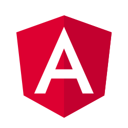

<!--
*chetanck03/chetanck03* is a ✨ special ✨ repository because its README.md (this file) appears on your GitHub profile.

Here are some ideas to get you started:

- I’m currently working on ...
- I’m currently learning ...
- I’m looking to collaborate on ...
- I’m looking for help with ...
- Ask me about ...
- How to reach me: ...
- Pronouns: ...
- Fun fact: ...
-->

    

# Technical Skills: 

  
  
  
  
  
  
  
  
  
  
  
  
  
  
  
  
  
  
  
  
  
  
  
  
  
  
  
  
  
  
  
  
  
  
  
  
  
  
  
  
  
  
  
  
  
  
  

# GitHub Stats:

  
  
  

